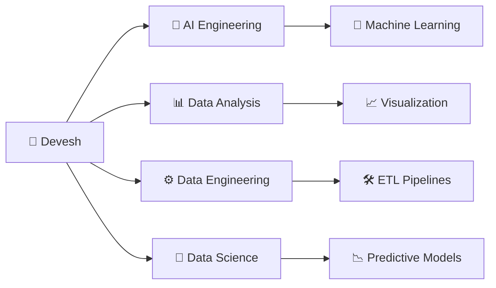

<h1 align="center">
  
</h1>

<!-- ANIMATED FOREST BANNER -->
<p align="center">
  
</p>

<!-- VISITOR COUNTER + BADGES -->
<p align="center">
  
  
  
  
</p>

---

## 🌲 **About Me - The Forest Explorer**



```python
# 🌿 My Life in Code
class DeveshKumarYadav:
    def __init__(self):
        self.name = "Devesh Kumar Yadav"
        self.location = "🌏 New Delhi, India"
        self.role = "🎓 B.Tech Student - AI & DS"

        self.aspirations = [
            "AI Engineering",
            "Data Analysis",
            "Data Engineering",
            "Data Science"
        ]

        self.motto = "🌲 Growing knowledge, one commit at a time!"

    def say_hi(self):
        return "Namaste! 🙏 Let's build something amazing!"
```
```
# 🛠️ My Tech Forest - Tools & Languages

### 🌿 Programming Languages

<p align="center">
  
  
  
  
  
  
  
  
  
</p>

### 🌳 AI & Data Science

<p align="center">
  
  
  
  
  
  
  
  
</p>

### 🌱 Data Engineering & Tools

<p align="center">
  
  
  
  
  
  
  
  
  
  
  
  
  
</p>

---

# 📊 GitHub Forest Stats

<p align="center">
  
  
</p>

<p align="center">
  
</p>

<!-- SNAKE ANIMATION EATING CONTRIBUTIONS -->

<p align="center">
  
</p>

---

# 🌟 Random Forest Quote Generator

<p align="center">
  
</p>

<p align="center">
  
</p>

---

# 🔥 What I'm Currently Growing

```javascript
const deveshForest = {
    currentlyLearning: [
        "Deep Learning Architectures 🧠",
        "Big Data Technologies (Hadoop, Spark) ⚡",
        "MLOps & Model Deployment 🚀",
        "Advanced SQL & Data Warehousing 🏗️"
    ],

    currentProjects: [
        "🌲 Forest Fire Prediction using ML",
        "📊 Real-time Data Pipeline",
        "🤖 AI Chatbot for Education"
    ],

    collaboration: "Open to AI/Data Science projects! 🤝"
};
```

---

# 🌐 Connect With Me - The Forest Network

<p align="center">

  <a href="https://www.linkedin.com/in/devesh-yadav-55b917313" target="_blank">
    
  </a>

  <a href="https://leetcode.com/u/VrnKRYSEBE/" target="_blank">
    
  </a>

  <a href="https://github.com/devesh-yadav-dot" target="_blank">
    
  </a>

  <a href="mailto:YOUR_EMAIL@gmail.com">
    
  </a>

</p>

---

# 🏆 GitHub Trophies - Forest Edition

<p align="center">
  
</p>

---

# 🌲 Daily Forest Fact

<details>
  <summary>🌿 Click to reveal a tree-mendous fact!</summary>

  <br>

  <p align="center">
    <b>🌳 Did you know?</b>
    <br><br>
    The oldest known tree is a Great Basin bristlecone pine named Methuselah,
    <br>
    estimated to be over 4,850 years old!
    <br><br>
    Just like that tree, keep growing your knowledge -
    it's never too late to learn! 🌱
  </p>

</details>

---

# 📈 This Week's Forest Growth

<!-- START_SECTION:waka -->

```text
Python     ████████████░░░░░░░░░   48.2%
SQL        ██████████░░░░░░░░░░░   32.1%
C          ██████░░░░░░░░░░░░░░░   18.5%
Java       ███░░░░░░░░░░░░░░░░░░   11.2%
```

<!-- END_SECTION:waka -->

---

<p align="center">
  
</p>

<p align="center">
  <b>🌲 "In the forest of code, every commit plants a seed." 🌲</b>
  <br>
  <i>- Devesh Kumar Yadav</i>
</p>

<p align="center">
  
</p>
```
